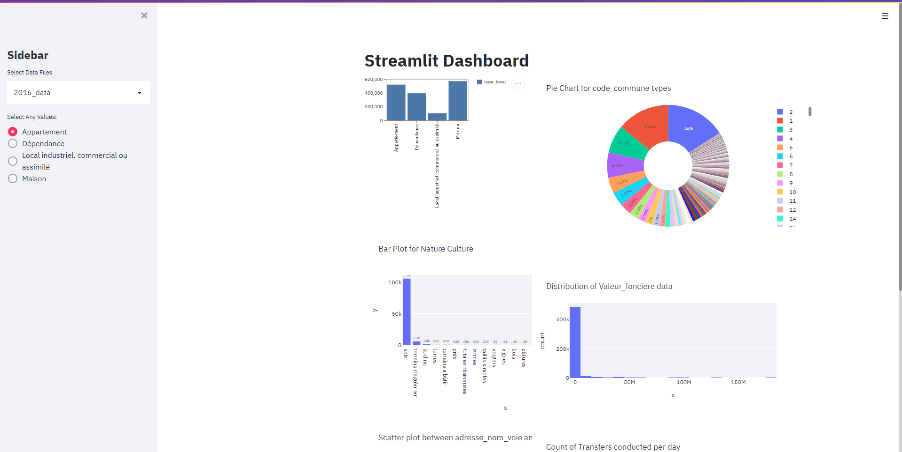

# streamlit_dashboard

## Setup

Download the repo and create a virtual env
1. On Windows: python -m venv dashboard
2. On Mac: virtualenv dashboard

To activate the environment
1. On Windows: dashboard\Scripts\activate.bat
2. On Mac: source dashboard/bin/activate

## Installing packages inside tutorial-env

```
pip install -r requirements.txt
```

## Dashboard
Run the following command to display the dashboard to users
```python
streamlit run web_app.py
```

## Analysis

From the sidebar, use can select any file and and select any value from radio button.

• The Bar plot contains analysis for nature_culture

• The slider plot contains line graph from which we can select any subset of plot as per slider and see the data

• The Histogram plot contains distribution of Valeur_fonciere data. As per the output the Valeur_fonciere is right skewed.

• The Pie chart contains overall percentage distrubution of the data, which part the common code users are from

• Scatter plot contains overall graph for adresse_nom_voie and total counts

• The Streamlit inbuild contains the bar graph for type_local column

## Screenshots




